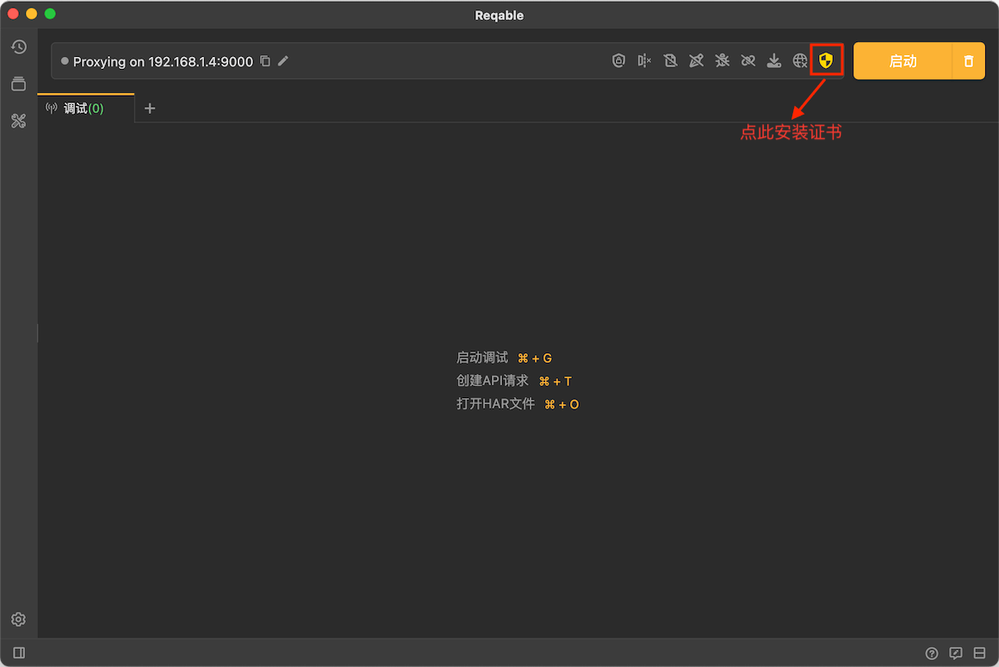
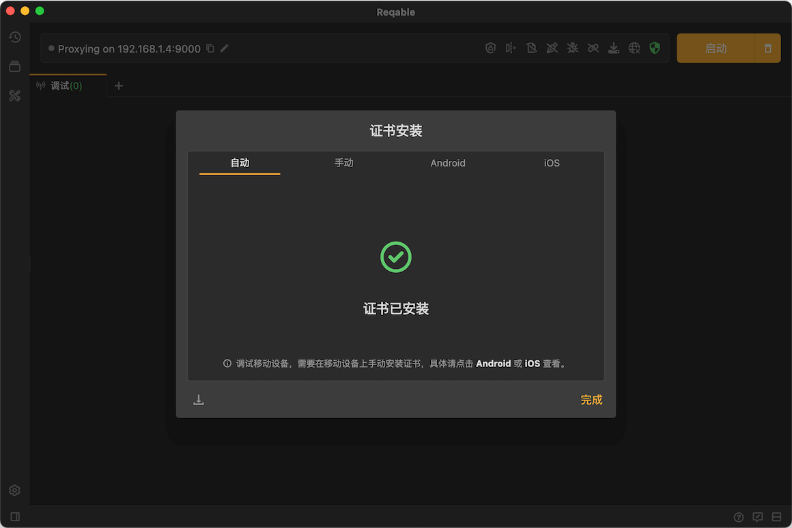

# 证书安装-MacOS

在MacOS设备上，Reqable提供了一键安装证书的功能，只需要输入用户的账户密钥即可！
首先，点击快捷操作栏上的盾牌图标（如图），打开证书安装操作入口。

:::note

SSL未安装时，盾牌图标显示为黄色；安装成功后，盾牌图标显示为绿色。

:::

点击“现在安装”，并在弹出框中输入账户密钥确认。

安装成功后，红色的❌会变为一个绿色的✅。

:::caution

如果一键安装失败，也可以按照指南“手动”安装！

:::