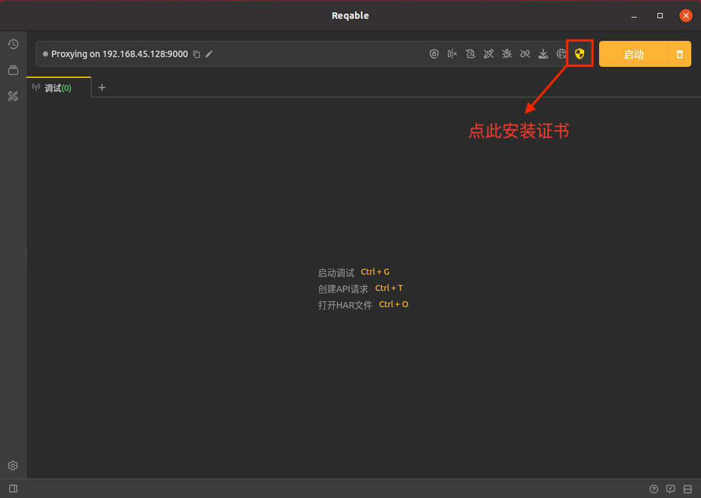
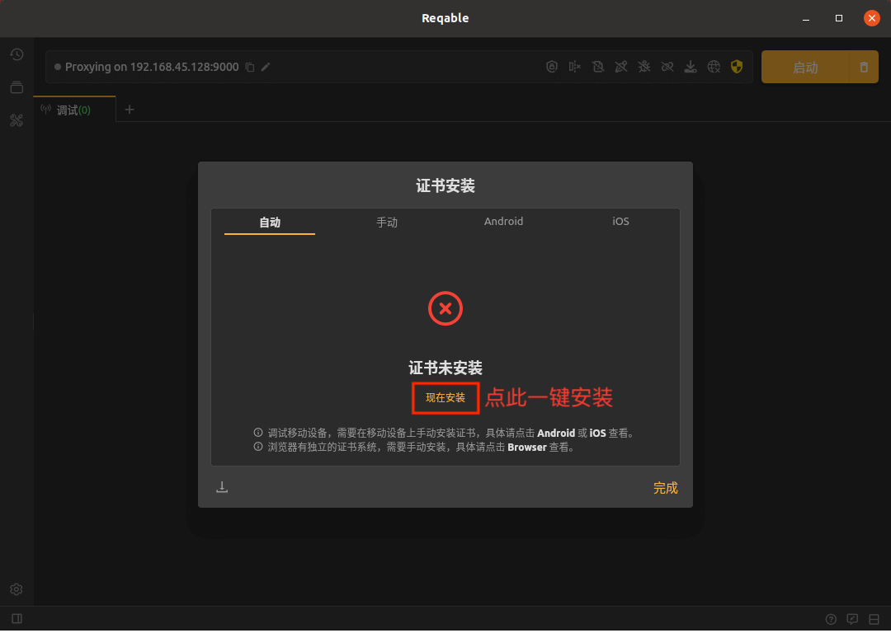
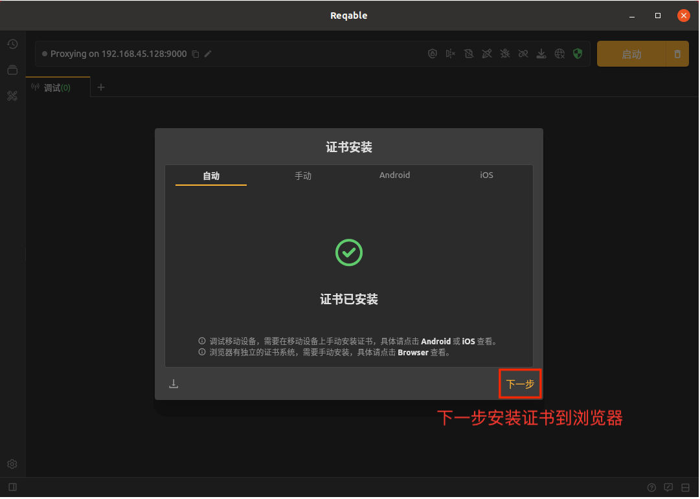
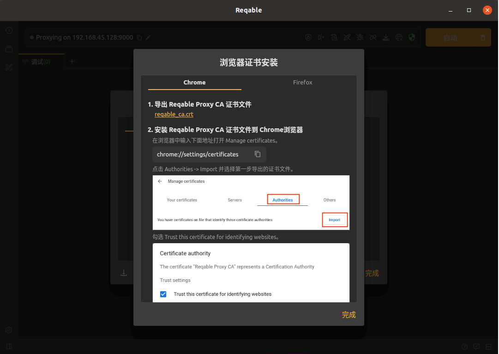

# 证书安装-Linux

在Linux设备上，Reqable提供了一键安装证书的功能，首先，点击快捷操作栏上的盾牌图标（如图），打开证书安装操作入口。

:::info

SSL未安装时，盾牌图标显示为黄色；安装成功后，盾牌图标显示为绿色。

:::

点击“现在安装”，，并在弹出框中输入账户密钥确认：

安装成功后，红色的❌会变为一个绿色的✅。

:::tip

如果一键安装失败，也可以按照指南“手动”安装！

:::

由于Linux的浏览器都是使用内置的CA证书，还需要将CA证书手动导入浏览器。

