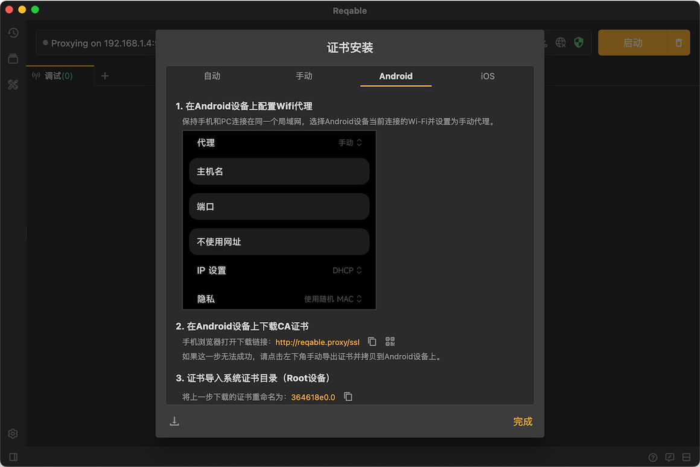

# 证书安装-Android

打开证书安装页面弹窗，切换到**Android**选项卡并按照指引安装证书：

:::caution
如果您的设备未Root，安装完证书并不代表能够监听HTTPS流量，进一步的配置请参阅[Android网络安全配置](https://developer.android.google.cn/training/articles/security-config)。
:::