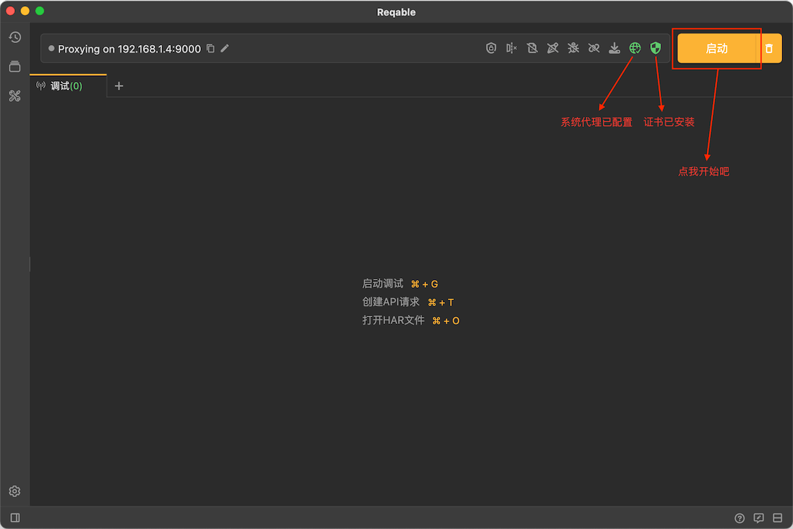

# 运行

import Shortcut from '@site/src/components/Shortcut';

我们点击右上角**开始**（快捷键 <Shortcut>Control + G</Shortcut> ）按钮开始抓包：

:::info 小技巧

如果无需全局抓包，可以不覆写系统代理，这样可以保证浏览器或者其他应用正常运行。

:::

抓包运行过程中，所有捕获到的请求都会呈现在列表中：

点击右上角**删除按钮**（快捷键 <Shortcut>Control + Shift + R</Shortcut> ）可以随时清空列表。