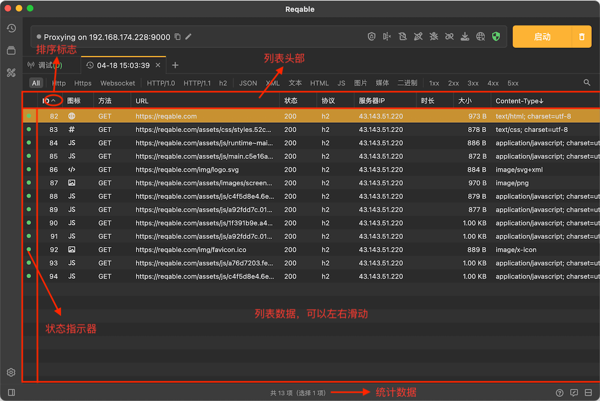
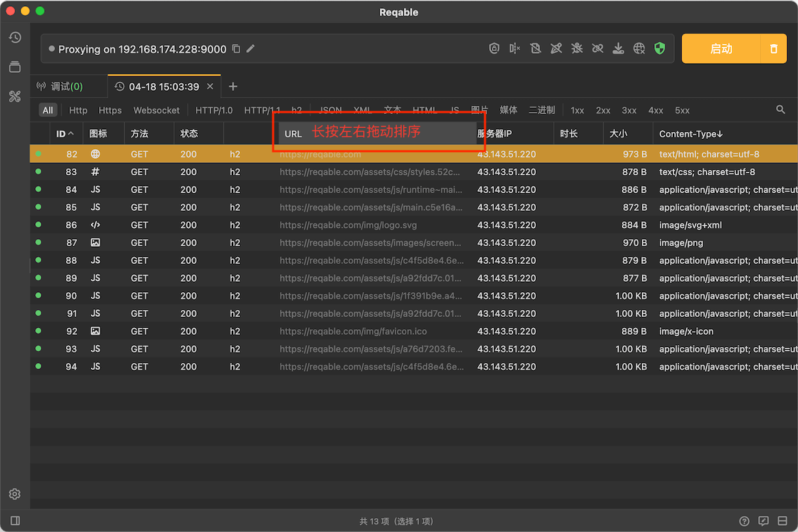

# 列表

import Shortcut from '@site/src/components/Shortcut';

下图描述了抓包列表各部件的功能：

### 列表头部

最上面的是列表的主要操作区：**列表头部**，这个区域可以控制列表的**列内容**，**列顺序**和**行排序**。比如，右键点击列表头部，可以打开列内容控制菜单：

长按左右拖动可以改变列顺序：

点击列表头部可以切换行列表排序方式：

### 列表数据

选中一个列表项，双击可以打开详情：

列表数据操作的快捷键如下：

- <Shortcut>Enter</Shortcut> 查看详情。
- <Shortcut>Control + A</Shortcut> 选择列表全部项。
- <Shortcut>↑/↓</Shortcut> 上下切换选中项。
- <Shortcut>Alt + ↑/↓</Shortcut> 选择首/尾项。
- <Shortcut>Shift + ↑/↓</Shortcut> 上下连续选择。
- <Shortcut>Control + 左键点击</Shortcut> 选择多项。
- <Shortcut>Shift + 左键点击</Shortcut> 选择连续多项。

### 状态指示

状态指示总是位于列表的最面前，分为三个颜色：绿色、黄色和灰色。三种颜色分别代表三种状态：请求完成、请求失败和请求中。