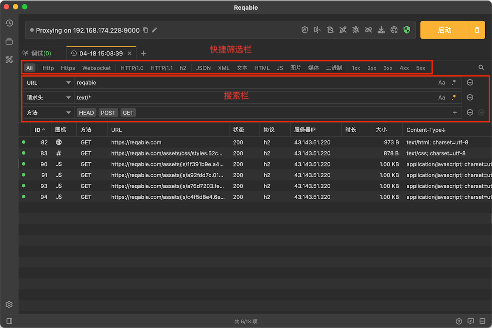

# 筛选和搜索

Reqable提供了快捷筛选和搜索两个功能：其中顶部的快捷筛选栏一直显示，搜索栏需要通过快捷键 `Ctrl + F` 打开。

最多可以设置三组搜索条件，包括URL、请求方法、请求类型，请求头、请求体、响应类型，响应头、响应体、服务器地址和高亮状态。其中文本搜索还支持大小写匹配和正则表达式。

:::info

MacOS上搜索快捷键是 Command + F 哦！

:::