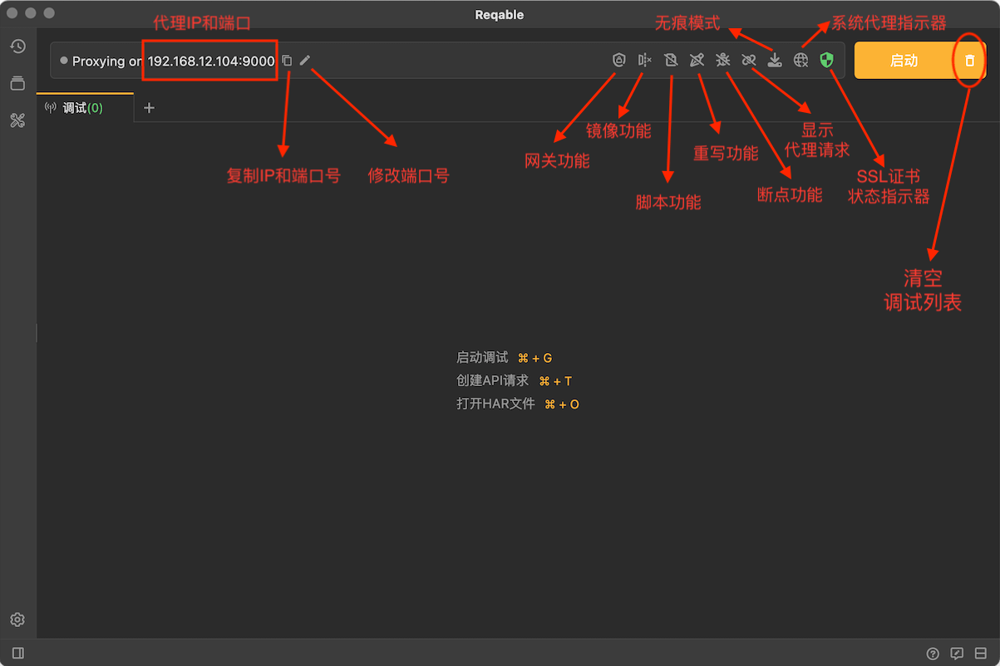
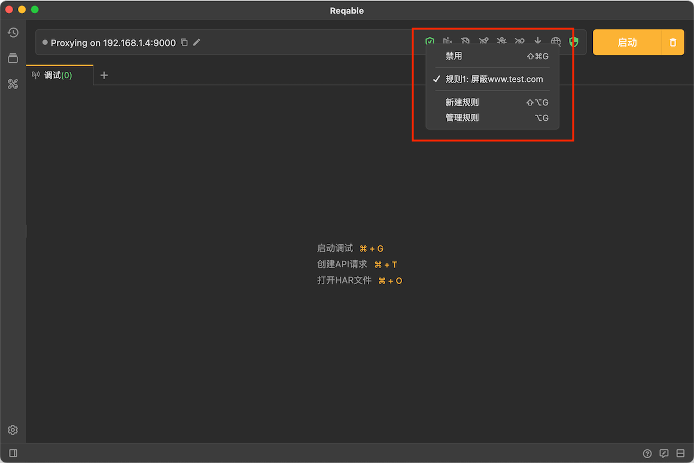

# 快捷操作栏

Reqable调试功能的入口几乎都放在了顶部的操作栏上，包括代理端口的修改、复制、重写、断点等，具体的功能说明如下图：

### 代理IP和端口

操作栏上会显示本机的IP和MITM代理服务器的端口号，便于远程设备局域网连接时快速设置。同时提供了两个快捷功能：
- 复制IP和端口号
- 修改端口号

### 网关功能

Reqable调试的核心功能之一：对指定请求或响应进行屏蔽，挂起，中断等操作，详细内容请查阅文档：

点击图标，开关功能：当功能未启用时，图标显示灰色；当功能启用时，图标显示绿色激活状态。  
右击图标，显示功能菜单：

### 镜像功能

Reqable调试的核心功能之一：对指定域名配置镜像。详细内容请查阅文档：

点击图标，开关功能：当功能未启用时，图标显示灰色；当功能启用时，图标显示绿色激活状态。  
右击图标，显示功能菜单（同上，图略）。

### 脚本功能

Reqable调试的核心功能之一：编写和挂载Python脚本处理请求或响应。详细内容请查阅文档：

点击图标，开关功能：当功能未启用时，图标显示灰色；当功能启用时，图标显示绿色激活状态。  
右击图标，显示功能菜单（同上，图略）。

### 重写功能

Reqable调试的核心功能之一：预设规则对指定请求或响应进行替换或修改等。详细内容请查阅文档：

点击图标，开关功能：当功能未启用时，图标显示灰色；当功能启用时，图标显示绿色激活状态。
右击图标，显示功能菜单（同上，图略）。

### 断点功能

Reqable调试的核心功能之一：对请求或响应进行实时断点操作。详细内容请查阅文档：

点击图标，开关功能：当功能未启用时，图标显示灰色；当功能启用时，图标显示绿色激活状态。  
右击图标，显示功能菜单（同上，图略）。

### 系统代理状态指示器 {#system-proxy}

显示系统代理的状态。如果系统已设置的Web代理和Reqable的代理一致，图标将显示绿色激活状态；反之，将显示黄色警告状态。  
绿色状态点击图标，将会取消系统Web代理。黄色状态点击图标，将会覆写系统代理设置。

:::caution

当需要对本机应用（例如浏览器等）进行抓包时，请保持系统代理为绿色激活状态！

:::

### SSL证书状态指示器

SSL证书安装状态指示器。详细内容请查阅文档：[证书安装和导出](/docs/capture/cert)