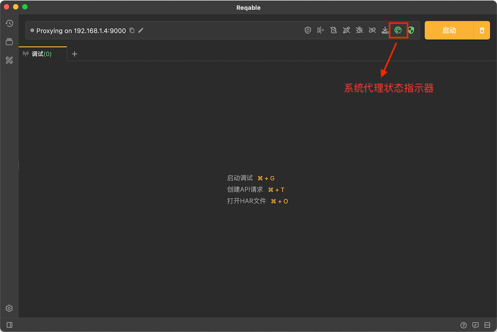
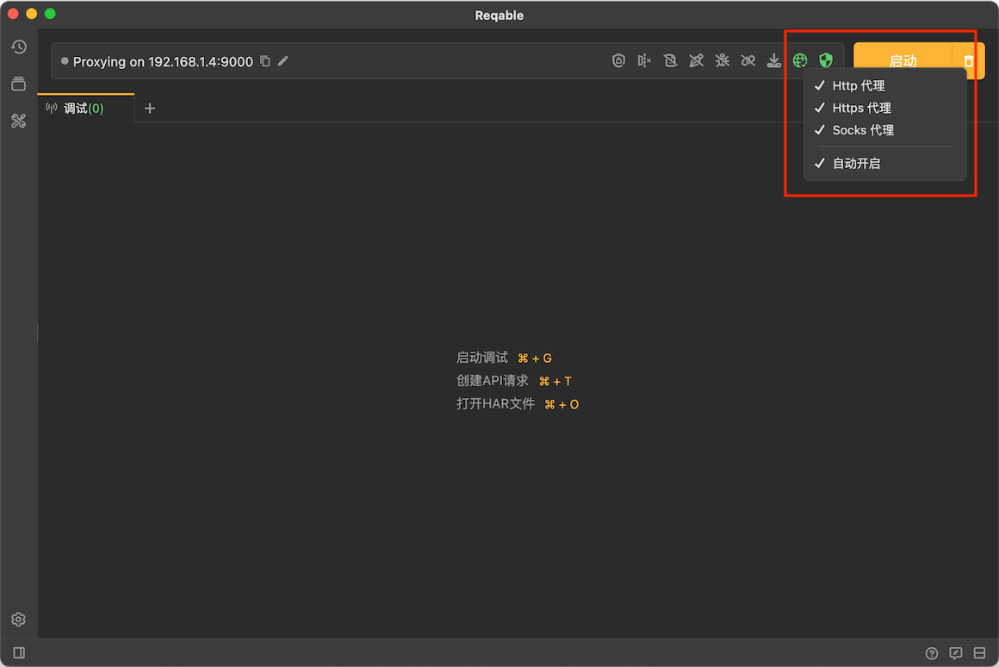

# 系统代理

Reqable抓包调试使用的是代理方式，所以代理的使用至关重要。默认情况下，Reqable会自动配置系统代理，无需用户手动打开系统设置页面配置。

在Quickbar上会显示系统代理的状态。如果系统代理状态和Reqable选择的代理一致，图标将显示绿色激活状态；反之，将显示黄色警告状态。绿色状态点击图标，将会关闭系统代理。黄色状态点击图标，将会覆写系统代理设置。

:::caution

当需要对本机应用（例如浏览器等）进行抓包时，请保持系统代理为绿色激活状态！

:::

### 代理协议

Reqable支持HTTP/HTTPS/Socks4/Socks4a/Socks5代理协议，监听同一个端口自动判断协议类型。用户可以自行切换或者配置所需代理协议。关于代理方式，不同计算机系统的代理方式不同。例如在Windows系统下常见的是Web代理方式（支持HTTP/HTTPS协议），当然也可以配置Socks代理方式（一般使用Socks4协议），二者只能配置其一，而在Unix系统下，分为HTTP代理、HTTPS代理和Socks代理（一般使用Socks5协议）三种方式。

:::info
此处请明确理解代理协议和代理方式的区别。
:::

Reqable无法指定具体的代理协议类型，但是可以指定代理方式，从而使用不同的代理协议。右键点击代理图标，打开选项菜单，下图是MacOS系统的代理配置选项（Windows系统略有不同）：

注意：如果勾选了**自动开启**选项，每次启动App的时候都会自动付覆写系统代理。