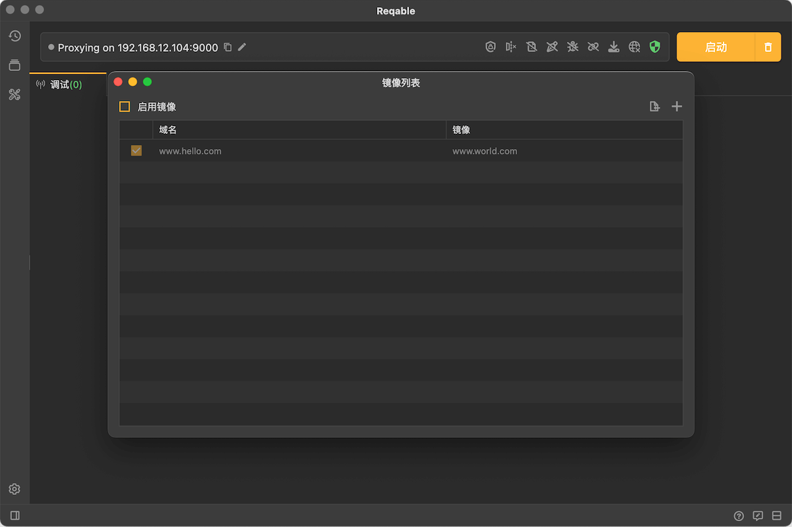
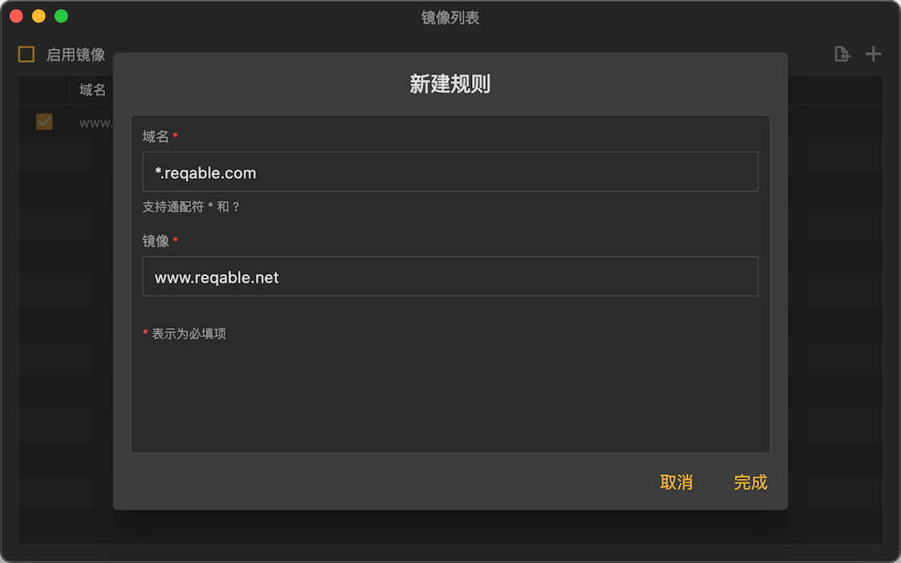
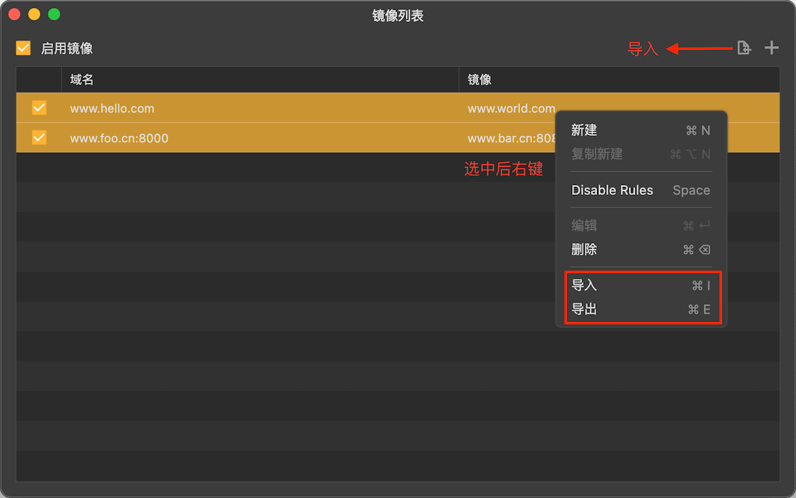

# 镜像

镜像是Reqable的核心调试功能之一，镜像是指域名映射。例如，访问域名A（`www.foo.com`），映射为访问域名B（`www.bar.com`）, 客户端所有发给域名A的请求都将发向域名B。此功能实现是在代理层处理，而不是应用层，属于整体重定向，如果有需要对指定路径请求进行重定向，请使用[重写——重定向](rewrite#redirect)功能。

镜像功能可以通过四种方式启用或关闭：
- 应用顶部菜单 -> 调试 -> 镜像 -> 启用/禁用
- 托盘 -> 镜像 -> 启用/禁用
- 调试页面 -> 右击镜像图标 -> 启用/禁用
- 快捷键

同样的，通过上述方式还可以打开镜像规则的管理页面。

### 创建规则

点击右上角 + 号按钮，或者 **右击 -> 新建** 创建一个新的镜像规则：

原始域名支持简单的Wildcard * 和 ? 匹配。上图映射的规则是将所有foo.com为后缀的域名全部映射为`www.reqable.com`。

:::note 关于端口号

如果不指定端口号，HTTP请求默认为**80**端口，HTTPS请求默认为**443**端口。  
当然，也可以显示地指定端口号，例如：*.foo.com:8080 -> www.bar.com:9000

:::

### 导入导出

Reqable支持镜像规则的批量导入和导出，方便与他人进行分享和协同。

