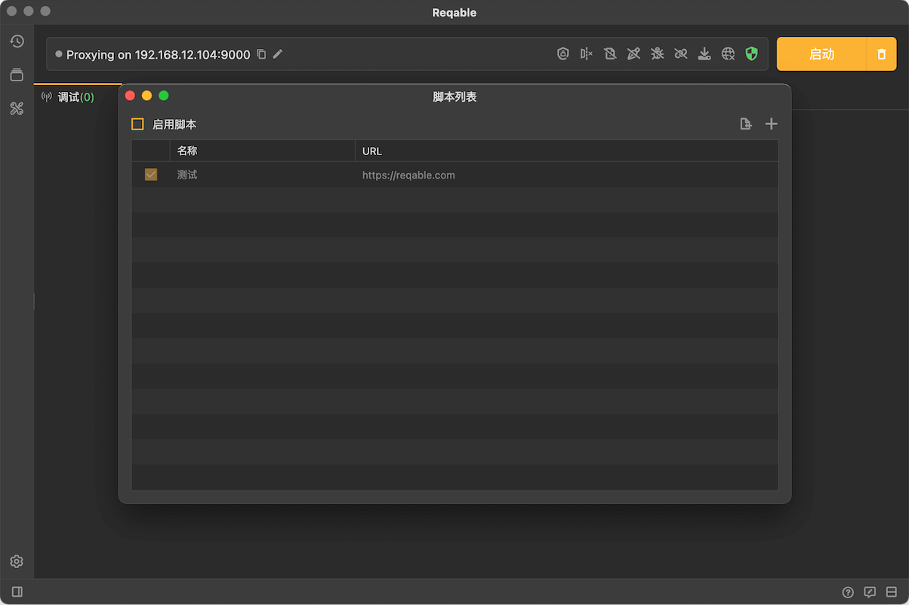
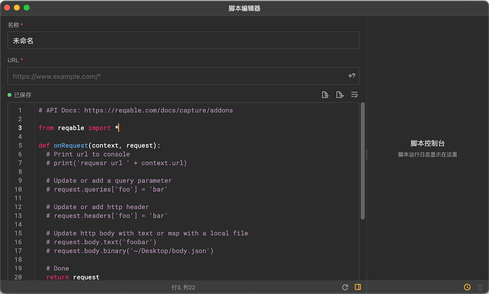
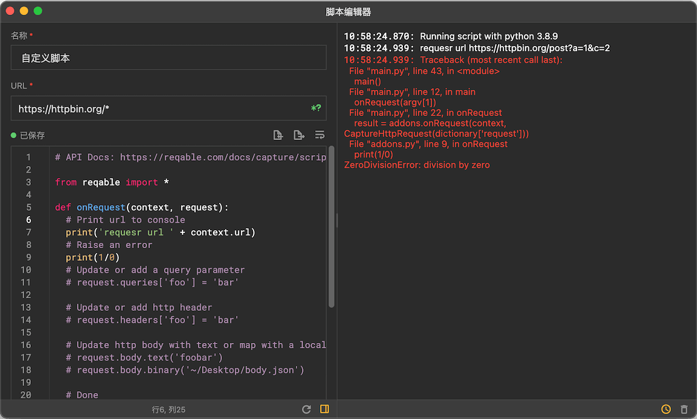
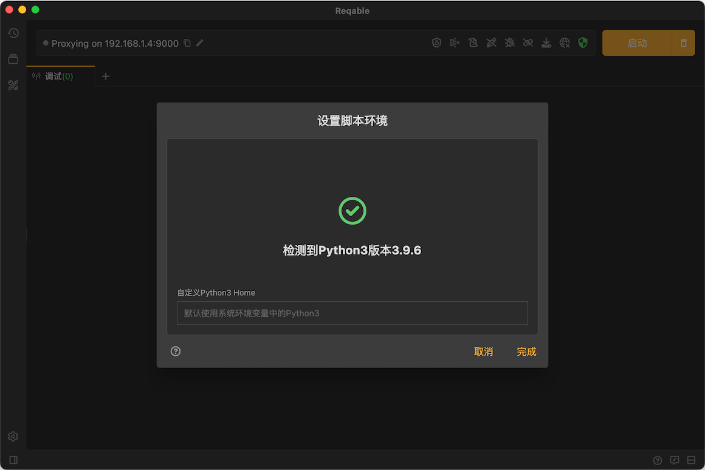
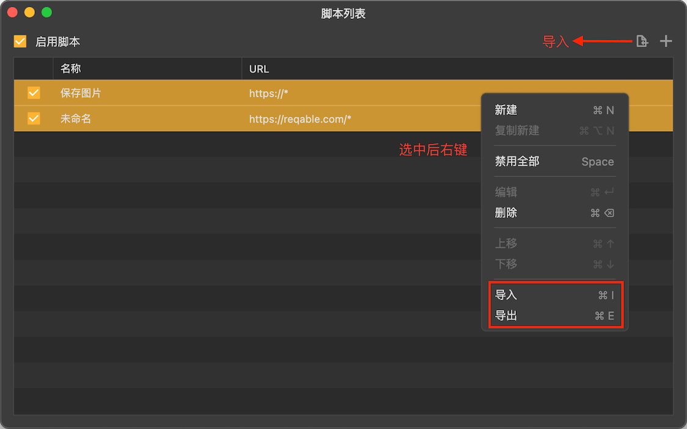

# 脚本

import Shortcut from '@site/src/components/Shortcut';

脚本是Reqable的核心调试功能之一，支持编写python脚本处理HTTP请求和响应。

脚本功能可以通过四种方式启用或关闭：
- 应用顶部菜单 -> 调试 -> 脚本 -> 启用/禁用
- 托盘 -> 脚本 -> 启用/禁用
- 调试页面 -> 右击脚本图标 -> 启用/禁用
- 快捷键

同样的，通过上述方式还可以打开脚本的管理页面。



点击右上角 + 号按钮，或者 **右击 -> 新建** 创建一个新的脚本：



输入规则名称和匹配的URL，URL支持简单的Wildcard * 和 ? 匹配，然后编写python脚本分别处理HTTP请求和响应。

### 编写脚本

脚本使用python3运行，必须使用python3的语法。脚本提供两个函数调用入口：`onRequest`和`onResponse`，顾名思义即请求和响应。

脚本修改后会自动保存，也可以手动使用快捷键 <Shortcut>Control + S</Shortcut> 立即保存。

#### onRequest

此函数在客户端请求发送给服务器前被调用，开发者可以在此函数作用域内对请求进行修改。函数接收两个参数[CaptureContext](#api-context)和[CaptureHttpRequest](#api-request)并返回[CaptureHttpRequest](#api-request)。

:::note 请求中断

如果需要中断此请求，onRequest函数结果返回None即可！

:::

#### onResponse

此函数在服务端响应发送给客户端前被调用，开发者可以在此函数作用域内对响应进行修改。函数接收两个参数[CaptureContext](#api-context)和[CaptureHttpResponse](#api-response)并返回[CaptureHttpResponse](#api-response)。

:::note 响应中断

如果需要中断此响应，onResponse函数结果返回None即可！

:::

#### 生命周期

需要注意的是，`onRequest` 和 `onResponse` 两个函数的分别运行在不同的进程中，所以两个函数无法直接共享外部变量。如果需要共享数据，请使用[CaptureContext](#api-context)的 `shared` 变量。

```python
def onRequest(context, request):
  context.shared = 'foobar'
  return request

def onResponse(context, response):
  print(context.shared) # print foobar
  return response
```

### API说明 {#api-addons}

以下是脚本框架中涉及的python类的API文档说明。

:::tip

变量名斜体表示只读，粗体表示可覆写。

:::

#### CaptureContext {#api-context}

|   变量  |  类型 |  说明  |
|  ----  | ----  | ----  |
|*url*|str|请求url，只读。|
|*schema*|str|请求标志符，值为http或https，只读。|
|*host*|str|域名，只读。|
|*port*|int|端口号，只读。|
|*cid*|int|TCP连接ID，只读。|
|*ctime*|int|TCP连接开始时间戳，单位毫秒，只读。|
|*sid*|int|HTTP会话ID，只读。|
|*stime*|int|HTTP会话开始时间戳，单位毫秒，只读。|
|**shared**|-|用于 `onRequest` 和 `onResponse` 之间共享数据的特殊变量，可以是str、int、list和dict等可自动序列化的变量。|

#### CaptureHttpRequest {#api-request}

|   变量  |  类型 |  说明  |
|  ----  | ----  | ----  |
|**method**|str|请求方法。|
|**path**|str|请求路径，注意不包含query部分。|
|*protocol*|str|请求的HTTP协议版本，只读。|
|**queries**|[CaptureHttpQueries](#api-queries)|请求参数列表。|
|**body**|[CaptureHttpBody](#api-body)|请求体。|
|**headers**|[CaptureHttpHeaders](#api-headers)|请求头列表。|
|**trailers**|[CaptureHttpHeaders](#api-headers)|请求尾部列表，参见HTTP1的chunked trailers或者HTTP2的trailers。注意此功能待验证，暂时请勿使用。|
|*contentType*|str或None|请求类型（即headers中的Content-Type的值），只读。|
|*mime*|str或None|请求MIME类型，例如application/json，只读。|

#### CaptureHttpResponse {#api-response}

|   变量  |  类型 |  说明  |
|  ----  | ----  | ----  |
|*request*|[CaptureHttpRequest](#api-request)|此响应的请求信息，只读。|
|**code**|int|响应状态码。|
|*message*|str|响应状态信息，只读。注意：HTTP2协议中，值为空；此值在状态码修改后会自动同步。|
|*protocol*|str|响应的HTTP协议版本，只读。|
|**body**|[CaptureHttpBody](#api-body)|响应体。|
|**headers**|[CaptureHttpHeaders](#api-headers)|响应头列表。|
|**trailers**|[CaptureHttpHeaders](#api-headers)|响应尾部列表，参见HTTP1的chunked trailers或者HTTP2的trailers。注意此功能待验证，暂时请勿使用。|
|*contentType*|str或None|响应类型（即headers中的Content-Type的值），只读。|
|*mime*|str或None|响应MIME类型，例如application/json，只读。|

#### CaptureHttpQueries {#api-queries}
|   函数  |  参数 |  返回 |  说明  |
|  ----  | ---- | ----  | ----  |
|len||int|返回query参数的个数。|
|iter|||支持迭代遍历全部的query参数。|
|add|str, str||新增一个query，参数为name和value。|
|remove|str||删除指定name的query。注意：如果有多个同名的，全部会移除。|
|clear|||清空所有query。|
|getitem|str|str|获取指定name的query值。注意：如果有多个同名的，会返回第一个；如果不存在，则返回None。|
|setitem|str, str||更新或新增query。如果存在指定name的query，则更新它的值，否则添加一个新的query参数。|

代码示例：
```python
def onRequest(context, request):
  # 打印query参数个数
  print(len(request.queries))
  # 遍历query参数
  for query in request.queries:
    print(query)
  # 新增query参数
  request.queries.add('foo', 'bar')
  # 移除query参数
  request.queries.remove('foo')
  # 清空全部query参数
  request.queries.clear()
  # 更新query参数，如果不存在则自动新增
  request.queries['foo'] = 'bar'
  # 打印指定query参数值
  print(request.queries['foo'])
  # Done
  return request
```

#### CaptureHttpHeaders {#api-headers}
|   函数  |  参数 |  返回 |  说明  |
|  ----  | ---- | ----  | ----  |
|len||int|返回header的个数。|
|iter|||支持迭代遍历全部的header。|
|add|str, str||新增一个header，参数为name和value。|
|remove|str||删除指定name的header。注意：如果有多个同名的，全部会移除。|
|clear|||清空所有header。|
|getitem|str|str|获取指定name的header值。注意：如果有多个同名的，会返回第一个；如果不存在，则返回None。|
|setitem|str, str||更新或新增header。如果存在指定name的header，则更新它的值，否则添加一个新的header。|

代码示例：
```python
def onRequest(context, request):
  # 打印headers参数个数
  print(len(request.headers))
  # 遍历header
  for header in request.headers:
    print(header)
  # 新增header
  request.headers.add('foo', 'bar')
  # 移除header
  request.headers.remove('foo')
  # 清空全部header
  request.headers.clear()
  # 更新header，如果不存在则自动新增
  request.headers['foo'] = 'bar'
  # 打印指定header值
  print(request.headers['foo'])
  # Done
  return request
```

#### CaptureHttpBody {#api-body}

|   变量  |  类型 |  说明  |
|  ----  | ----  | ----  |
|*type_none*|int|表示空Body，枚举值。此类型时，payload为None。|
|*type_text*|int|表示Body类型为字符串，枚举值。此类型时，payload为str。|
|*type_binary*|int|表示Body类型为字节数据，枚举值。此类型时，payload为list。|
|*type_multipart*|int|表示Body类型为multiparts类型，枚举值。此类型时，payload为[CaptureHttpMultipartBody](#api-multipart-body)的列表。|
|**type**|int|上面四个枚举值之一，表示Body的类型。|
|**payload**|多态类型，参照上方说明。|Body的数据。|

|   函数  |  参数 |  返回 |  说明  |
|  ----  | ---- | ----  | ----  |
|none|||设置为空Body。|
|text|str||设置为字符串Body，内容为参数值。|
|textFromFile|str||设置为字符串Body，并从指定文件路径中读取字符串数据。|
|binary|str或bytes||设置为字节Body，参数为str时表示从指定文件路径中读取数据。|
|multiparts|list||设置为Multipart Body，参数为[CaptureHttpMultipartBody](#api-multipart-body)的列表。|
|writeFile|str||将Body数据写入文件。注意：不支持Multipart类型Body。|

代码示例：
```python
def onRequest(context, request):
  # 打印body类型
  print(request.body.type)
  if request.body.type == CaptureHttpBody.type_none:
    print('Http no body')
  elif request.body.type == CaptureHttpBody.type_text:
    print('Http text body: ' + request.body.payload)
  elif request.body.type == CaptureHttpBody.type_binary:
    print(f'Http binary body: size {len(request.body.payload)}' )
  elif request.body.type == CaptureHttpBody.type_multipart:
    print(f'Http binary body: multipart size {len(request.body.payload)}' )

  # 修改body为空
  request.body.none()
  # 修改body为字符串
  request.body.text('foobar')
  # 修改body为字符串，内容从文件读取
  request.body.textFromFile('/User/Reqable/Desktop/body.json')
  # 修改body为字节序列，直接指定
  request.body.binary(b'\x01\x02\x03\x04')
  # 修改body为字节序列，内容从文件读取
  request.body.binary('~/Desktop/body.json')
  # 修改body为multipart类型
  request.body.multiparts([
    part1,
    part2,
    part3,
  ])

  # 将body数据写入文件
  request.body.writeFile('/User/Reqable/Desktop/body.json')

  # Done
  return request
```

#### CaptureHttpMultipartBody {#api-multipart-body}

CaptureHttpMultipartBody继承于[CaptureHttpBody](#api-body)，额外多出一个headers成员。

|   变量  |  类型 |  说明  |
|  ----  | ----  | ----  |
|**headers**|[CaptureHttpHeaders](#api-headers)|分部头部。|

代码示例：
```python
# 构建CaptureHttpMultipartBody对象
CaptureHttpMultipartBody({
  'headers': [
    'Content-Type: text/plain',
    'Content-Length: 3',
    'Content-Disposition: form-data; name="field2"; filename="example.txt"',
  ],
  'payload': {
    'type': CaptureHttpBody.type_text,
    'payload': 'foobar',
  }
})
```

:::caution

如果将非multipart类型修改成multipart类型，必须同时修改headers设置boundary！

:::

### 调试控制台

Reqable提供了脚本控制台功能，方便开发人员查看脚本的日志输出，以及脚本报错的backtrace信息。在脚本执行的过程中保持脚本编辑器窗口打开，所有的信息都会实时输出到右侧的控制台中。



上图示例中，我们编写了一个除零错误，控制台中也产生了相应的报错信息。

### 运行环境 {#env}

脚本功能依赖于本机的python3环境，请务必保证本机设备上安装了python3。新手请参考[Python3下载和安装](https://www.runoob.com/python3/python3-install.html)。

:::caution

**要求Python3版本必须大于 3.6**

:::

如果本机上有多个python3环境，可以手动指定Python3 Home路径：**右击脚本图标 -> 设置环境**



### 执行顺序

一个请求或者响应可以挂载多个脚本（通过新建不同的规则来匹配同一个url），那必然会涉及到脚本执行先后顺序的问题。我们可以在脚本列表中调整先后顺序（快捷键 <Shortcut>Control + ↓/↑</Shortcut>）来设定优先级，列表靠前的先执行。

### 导入导出

Reqable支持脚本的批量导入和导出，方便与他人进行分享和协同。



### 示例

下面是一个自动保存图片的脚本示例。

```python
from reqable import *
from mimetypes import guess_extension
import datetime
import os

def onRequest(context, request):
  return request

def onResponse(context, response):
  # 检查Mime类型，非图片类型则跳过不处理
  mime = response.mime
  if mime == None:
    return response

  maintype, subtype = mime.split('/')
  if not maintype == 'image':
    return response

  # 保存图片到指定目录，文件名为时间戳，后缀根据Mime类型推导
  dir = '/Users/megatronking/Downloads/reqable/'
  os.makedirs(dir, exist_ok=True)
  name = datetime.datetime.now().strftime("%H%M%S%f")
  ext = guess_extension(mime)
  image = os.path.join(dir, name + ext)

  # 响应体写入文件
  print(f'Saving image {image}')
  response.body.writeFile(image)

  # Done
  return response
```