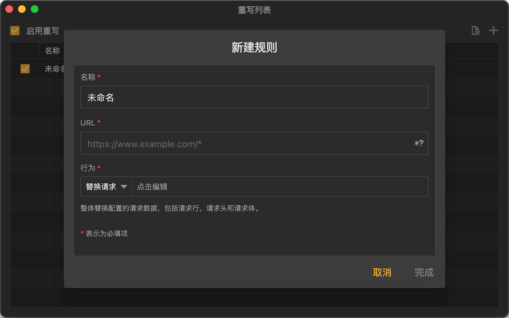
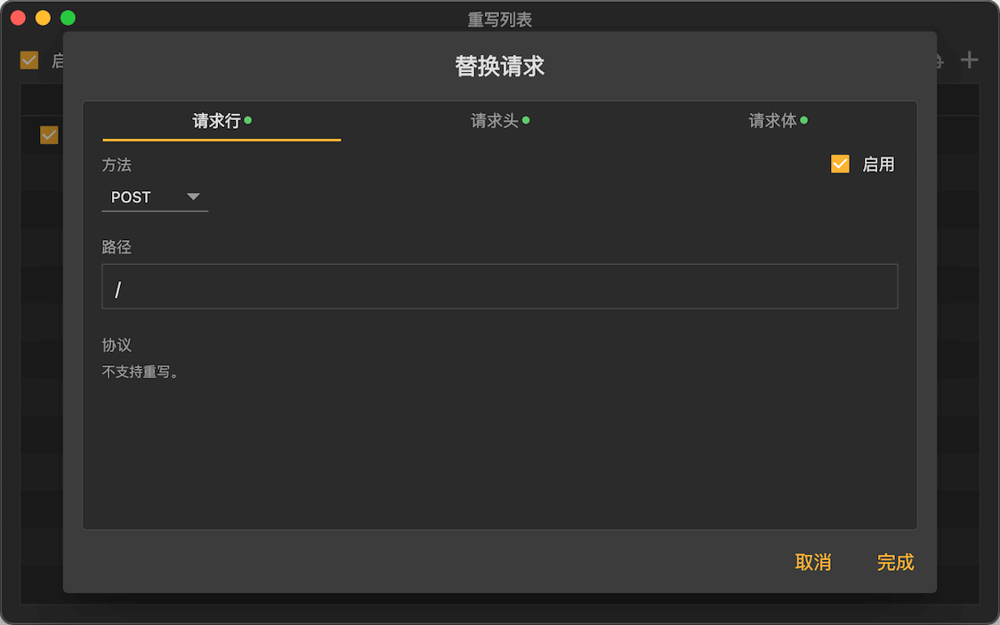
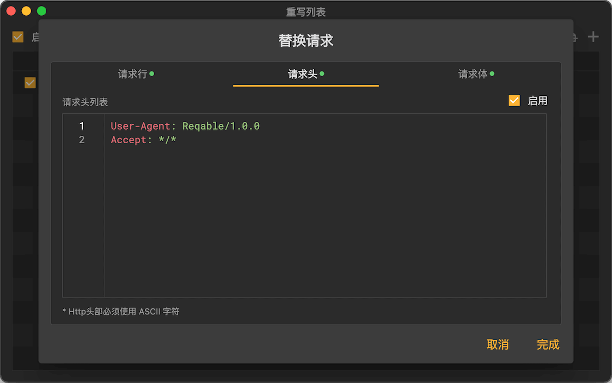
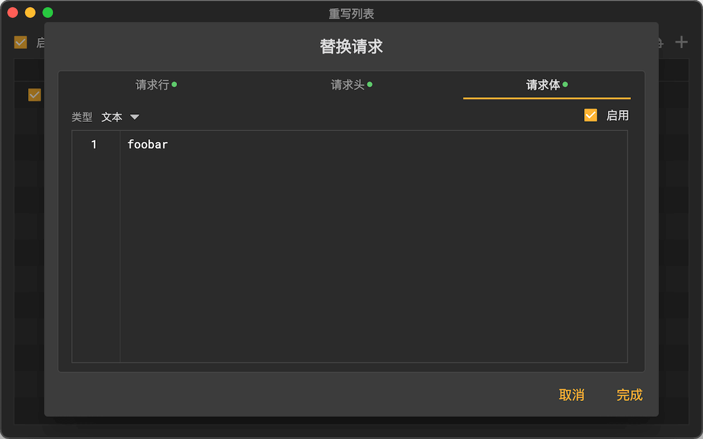
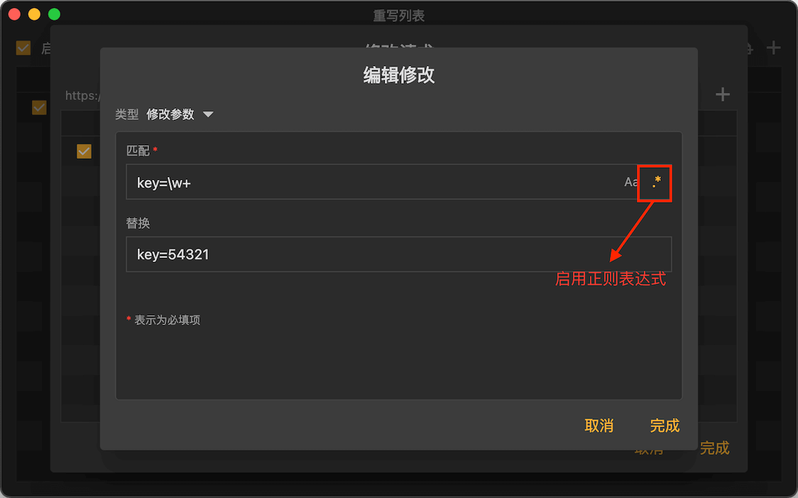
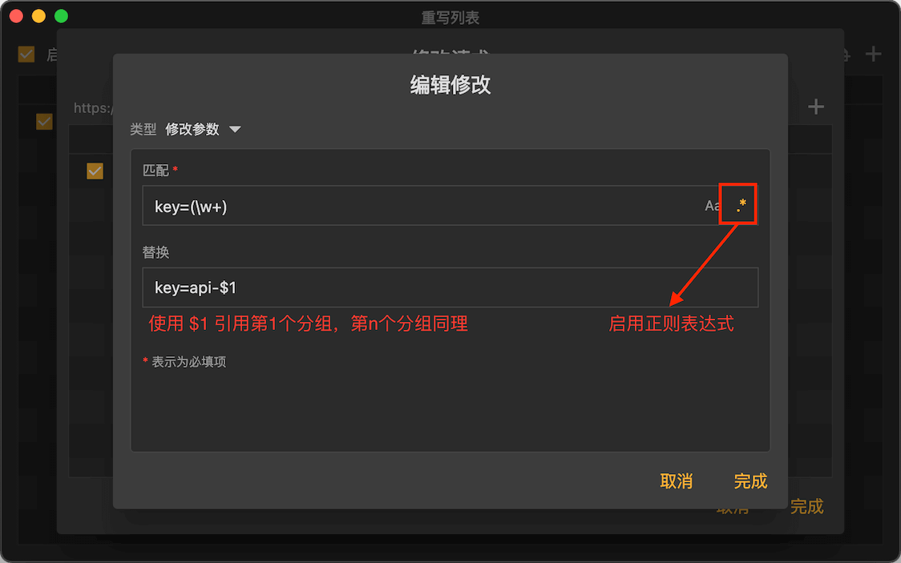
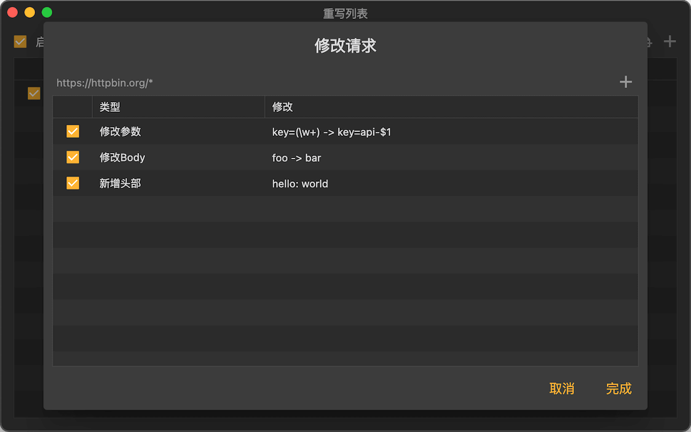

# 重写

重写是Reqable的核心调试功能之一，通过预设匹配条件和修改规则静态地处理请求和响应。

重写功能可以通过四种方式启用或关闭：
- 应用顶部菜单 -> 调试 -> 重写 -> 启用/禁用
- 托盘 -> 重写 -> 启用/禁用
- 调试页面 -> 右击重写图标 -> 启用/禁用
- 快捷键

同样的，通过上述方式还可以打开重写的管理页面。


### 创建规则

点击右上角 + 号按钮，或者 **右击 -> 新建** 创建一个新的重写规则：



输入规则名称和匹配的URL，URL支持简单的Wildcard * 和 ? 匹配，最后设置一个重写行为。Reqable支持以下四种重写行为。

### 替换请求{#replace-req}

此重写行为表示整体替换请求数据，支持替换的部分包括：请求方法、请求路径、请求头和请求体。

#### 替换请求方法和路径

如论原始请求方法和路径是什么，都会被替换成预设的请求方法和路径：



#### 替换请求头 {#repleace-req-headers}

如论原始请求头是什么，都会被替换成预设的请求头：



:::caution 关于Content-Length

无论是否有预设Content-Length，最终Content-Length的值都会根据编码方式自动重新计算。所以替换头部的时候无需关心Content-Length。

:::

#### 替换请求体 {#repleace-req-body}

如论原始请求体是什么，都会被替换成预设的请求体：



Reqable支持预设三种替换请求体类型：空、文本和文件。

### 替换响应 {#replace-res}

此重写行为表示整体替换响应数据，支持替换的部分包括：响应状态、响应头和响应体。

#### 替换响应状态

如论原始响应状态是什么，都会被替换成预设的响应状态：


#### 替换响应头

参考 [替换请求头](#repleace-req-headers)

#### 替换响应体

参考 [替换请求体](#repleace-req-body)

### 修改请求 {#modify-req}

相比于[替换请求](##replace-req)行为，修改请求提供了更加细致化的修改策略。例如删除查询参数，修改请求头中的某一项，正则替换请求体的内容。

举个例子。有下面这样的请求参数，我们希望修改key的值为54321，但保留其他的参数不变。

```url
https://reqable.com?key=12345&foo=bar&hello=world
```

现在只需要创建一个key的匹配替换规则即可：


如果复杂一点，我们不知道key的具体值，但是仍然希望替换为54321，可以使用正则表达式：



再复杂一些，如果我们希望在原始key值的基础上加一个前缀 `api-` , 可以使用正则表达式和 `$` 分组替换：



一个请求可以创建并应用多个修改规则，我们可以在列表中进行管理。



:::caution 注意事项

- 此模式不支持修改请求方法和请求路径。
- 请勿修改请求头Content-Length的值，因为最终Content-Length的值都会根据编码方式自动重新计算。

:::

### 修改响应 {#modify-res}

使用方式参考 [修改请求](#modify-req)。

:::caution 注意事项

- 此模式不支持修改响应状态码。
- 请勿修改响应头Content-Length的值，因为最终Content-Length的值都会根据编码方式自动重新计算。

:::

### 执行顺序

一个请求或者响应可以被多次重写（通过新建不同的规则来匹配同一个url），那必然会涉及到执行先后顺序的问题。我们可以在重写规则列表中调整先后顺序（快捷键`Ctrl` + `↓/↑`）来设定优先级，列表靠前的先执行。

### 导入导出

Reqable支持重写规则的批量导入和导出，方便与他人进行分享和协同。

