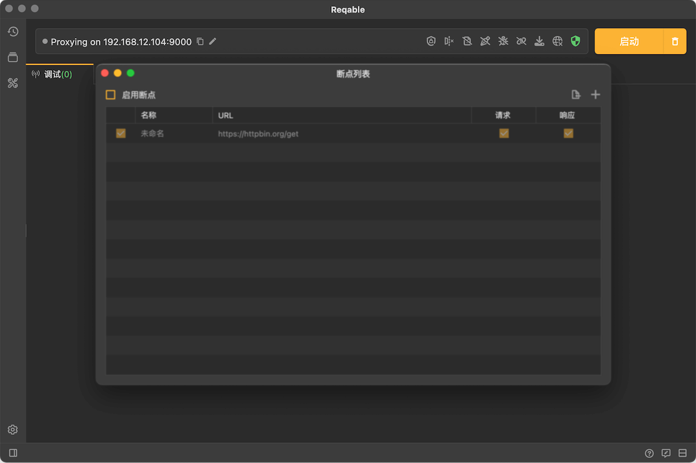
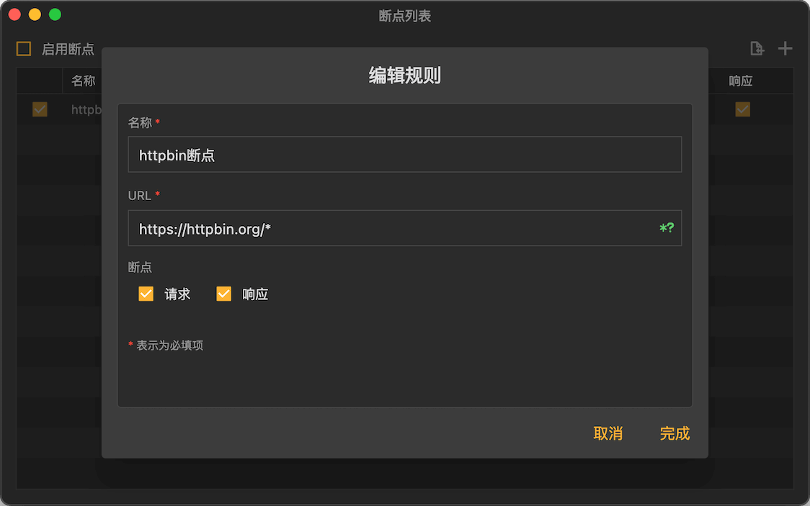
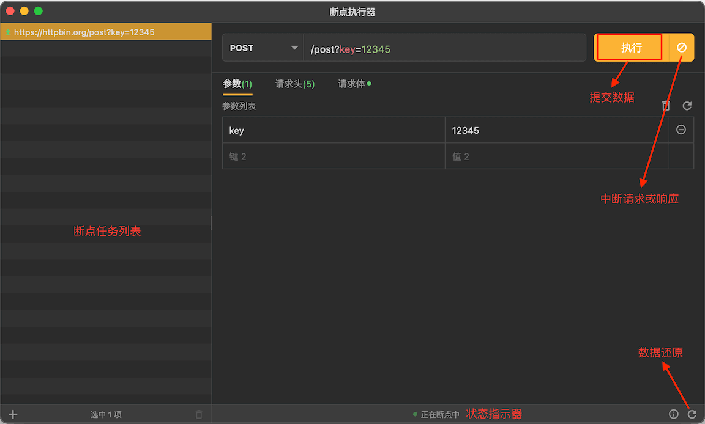
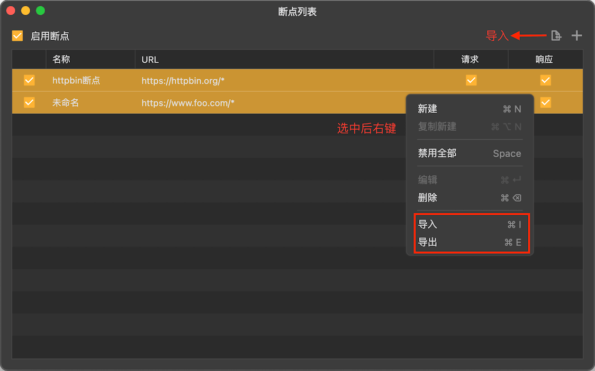

# 断点

断点是Reqable的核心调试功能之一，通过设定匹配规则，触发断点后实时控制和修改请求和响应。

断点功能可以通过四种方式启用或关闭：
- 应用顶部菜单 -> 调试 -> 断点 -> 启用/禁用
- 托盘 -> 断点 -> 启用/禁用
- 调试页面 -> 右击断点图标 -> 启用/禁用
- 快捷键

同样的，通过上述方式还可以打开断点的管理页面。

### 创建规则

点击右上角 + 号按钮，或者 **右击 -> 新建** 创建一个新的断点规则：

输入规则名称和匹配的URL，URL支持简单的Wildcard * 和 ? 匹配。完成后，当请求或响应发生时，便可以进入断点操作界面。

### 断点执行器 {#executor}

断点生效后，会自动弹出下图的操作界面。我们可以在这个页面上，修改数据然后提交。

:::caution 注意事项

每个断点请求（响应）有**180s**的时间进行操作，超时后断点会自动失效，暂停住的请求和响应会继续。

:::

### 导入导出

Reqable支持断点规则的批量导入和导出，方便与他人进行分享和协同。

