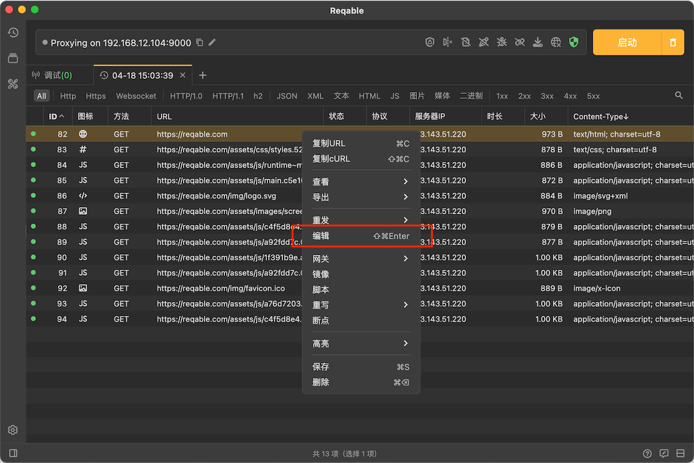
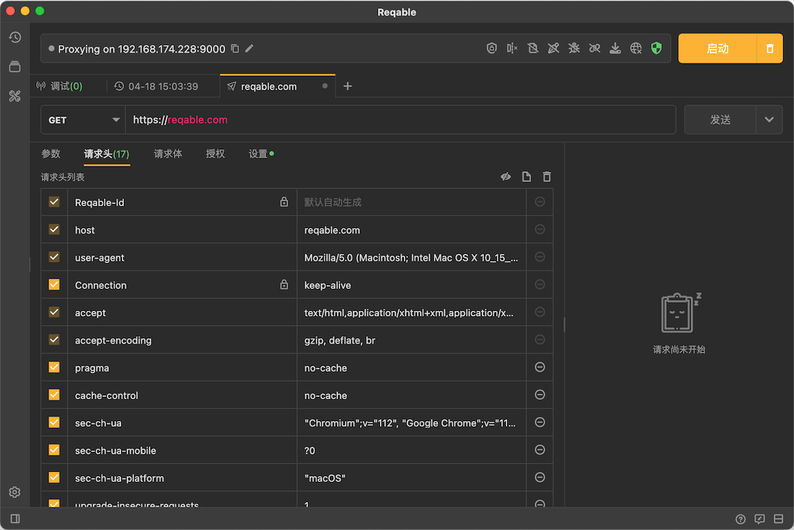

# 编辑请求

import Shortcut from '@site/src/components/Shortcut';

Reqable支持对捕获的请求进行二次编辑（即导入[接口](../rest)编辑器），从列表中选中一个记录 -> 右键 -> 编辑，或者使用快捷键 <Shortcut>Control + Shift + Enter</Shortcut> ：

请求方法、请求协议、请求路径、请求参数、请求头部和请求体都会自动导入到接口编辑器中：

