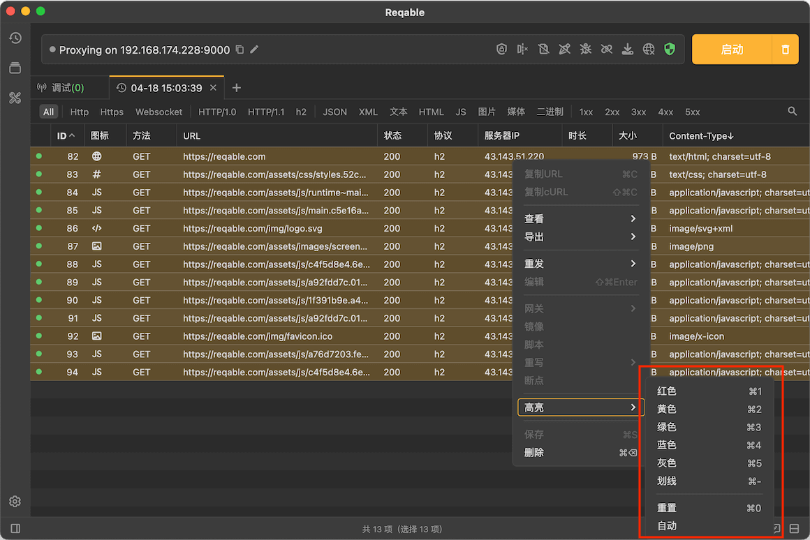
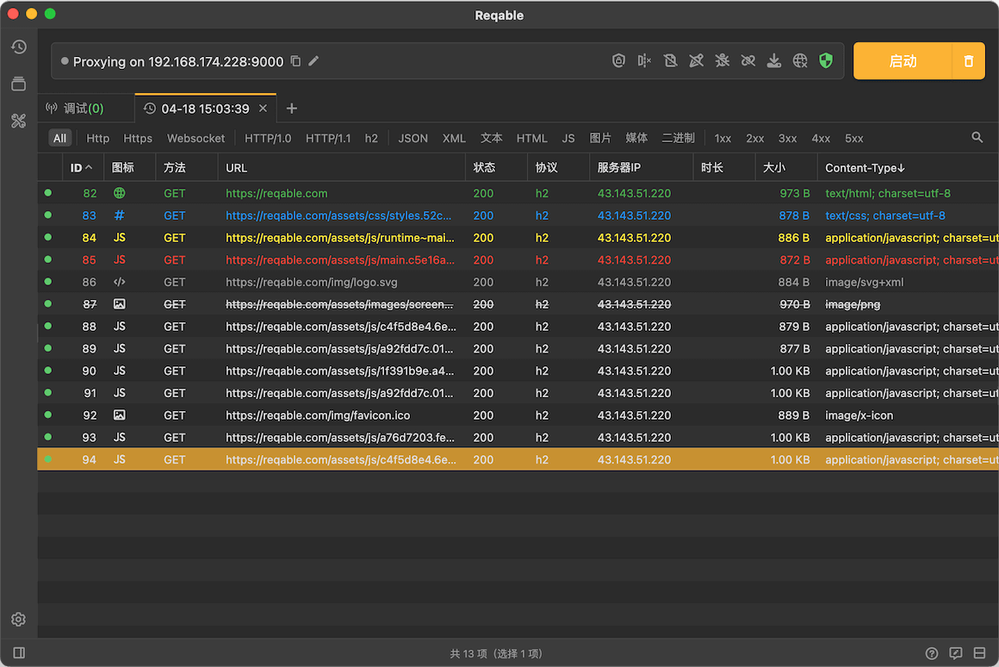
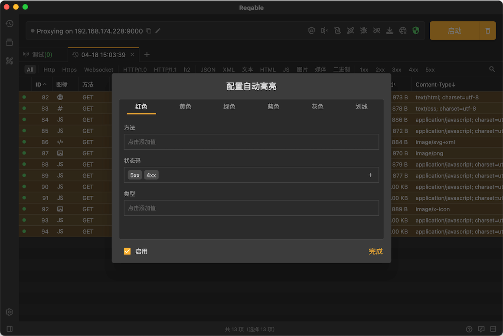

# 高亮

import Shortcut from '@site/src/components/Shortcut';

Reqable可以对记录设置高亮状态，支持**红色**、**黄色**、**绿色**、**蓝色**、**灰色**和**下划线**六种。从列表中选中一个或多个记录 -> 右键 -> 高亮：

当然，也可以使用快捷键 <Shortcut>Control + 1/2/3/4/5/-</Shortcut> ，高亮效果如下：

如果要取消高亮状态，可以使用快捷键 <Shortcut>Control + 0</Shortcut> 。

Reqable还可以对高亮的记录进行筛选，只需要打开搜索栏并指定高亮状态：

