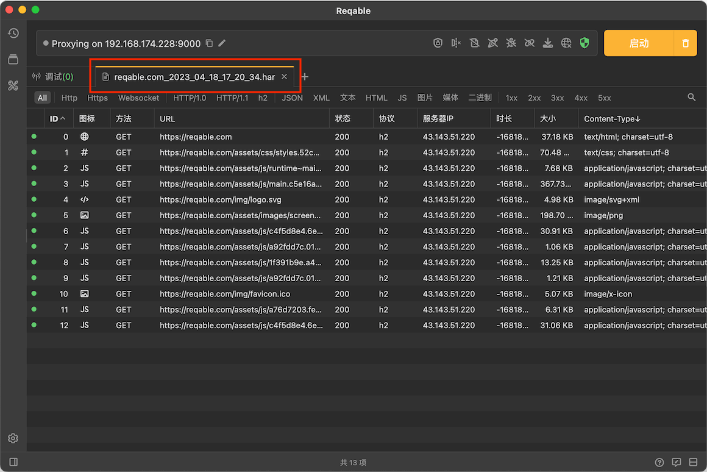
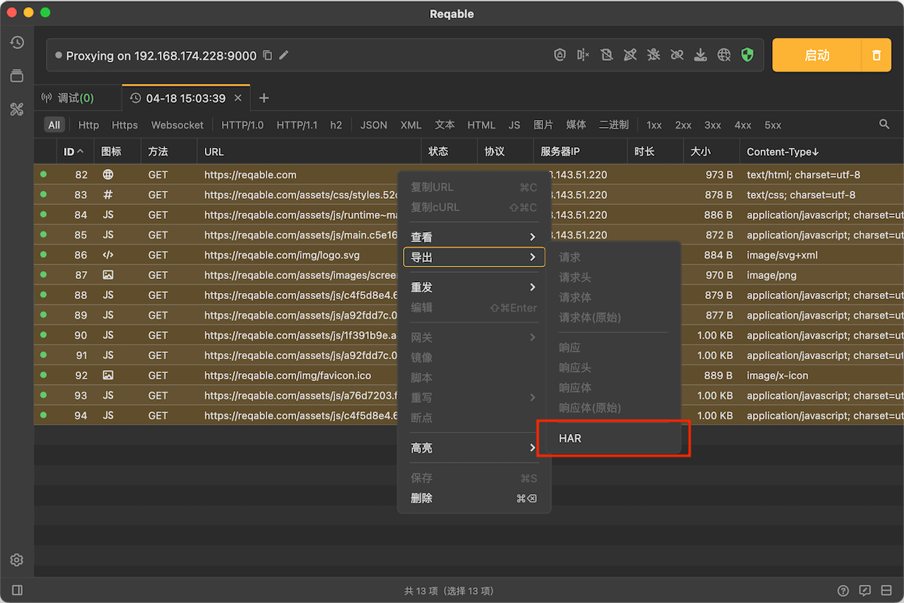

# HAR支持

import Shortcut from '@site/src/components/Shortcut';

Reqable支持打开和导出[HAR](https://en.wikipedia.org/wiki/HAR_(file_format))格式文件。  

使用快捷键 <Shortcut>Control + O</Shortcut> 打开HAR文件：

导出HAR文件，只需要 选择列表项 -> 右键 -> 导出 -> HAR 即可：

