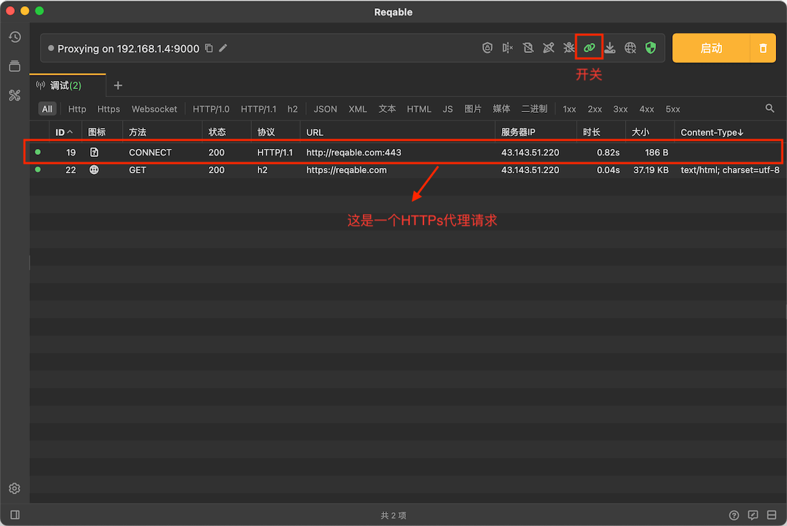

# 代理请求

HTTPS请求在建立TCP连接前，会先使用Connect请求方法向代理服务器发送一次明文HTTP请求。默认情况下，Reqable列表不会显示这些代理请求，因为这些请求并不包含实际的业务数据。但是Reqable仍然提供了显示开关，打开后能够看到客户端发起了哪些代理请求。

:::info 注意
此功能仅当配置了HTTPS代理时生效，如果代理方式是HTTP或者Sock则不生效。关于代理方式，请参阅[此处](proxy)。
:::

注意，https代理请求以下功能无法使用：
- [重发](repeat)
- [编辑](compose)
- [网关](gateway)
- [镜像](mirror)
- [重写](rewrite)
- [脚本](script)
- [断点](breakpoint)