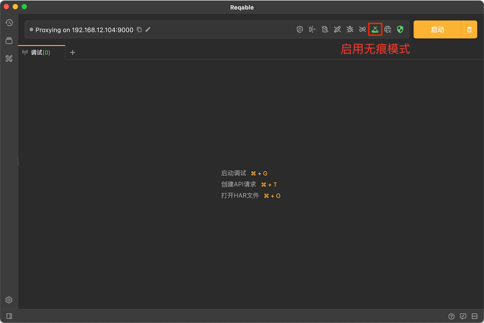
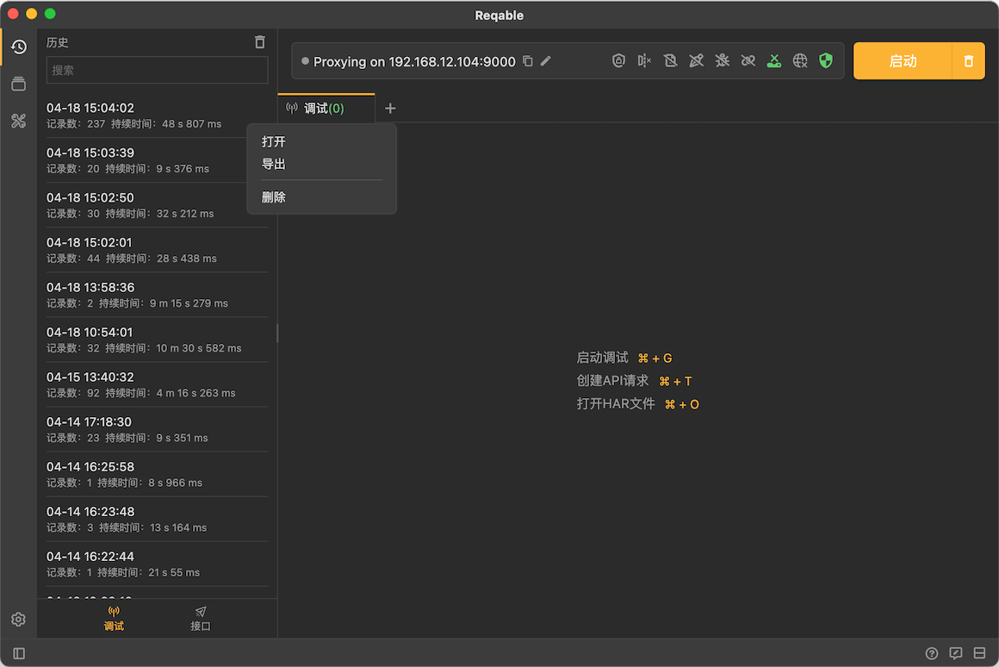

# 自动保存

import Shortcut from '@site/src/components/Shortcut';

Reqable支持自动将调试数据保存到历史记录中，开启下图所示的图标即可。

当然，还可以选中列表项后右键手动保存，快捷键 <Shortcut>Control + S</Shortcut> ：

然后，随时可以历史记录中选择并添加回操作列表中（点击即可）：

:::caution 注意事项

出于性能考虑，切换到历史Tab后不会自动刷新，需要手动点击右上角**刷新按钮**（快捷键 <Shortcut>F5</Shortcut> ）。

:::