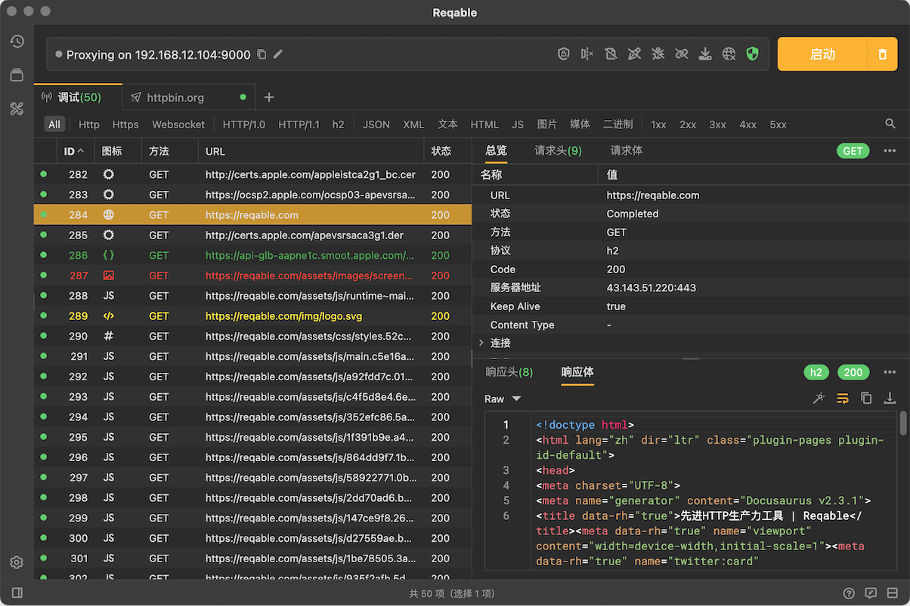

# 调试

抓包技术在HTTP开发和测试中有着不可或缺的作用，这也是Reqable的两大基本功能之一。Reqable提供了丰富的抓包调试功能，例如[网关](gateway)、[镜像](mirror)、[脚本](script)、[重写](rewrite)和[断点](breakpoint)等。

### 原理

Reqable的抓包是基于经典的MITM（中间人）Web代理技术，这也是Charles、Fiddler等知名竞品选择的方案。在代理服务器的实现上，我们选择了boost的asio异步方案，这有利于创建高效稳定的代理服务。

当代理服务器收到HTTP请求时，Reqable便能够获取到请求数据并转发到服务器。对于加密的HTTPS请求，代理服务器会分别与客户端和服务器端进行SSL握手，这个过程中代理服务器需要构建证书并签名（需要安装证书并授信的原因），握手成功后，Reqable便能够获取到明文信息了。

### 知识点

Reqable是一个专业性的HTTP调试工具，为了更好地使用Reqable，使用者应当熟悉如下知识点：
- HTTP协议的基本结构。
- 正则表达式。
- Python语法。