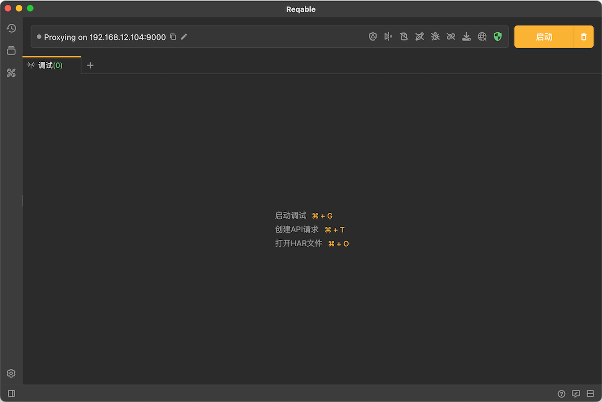
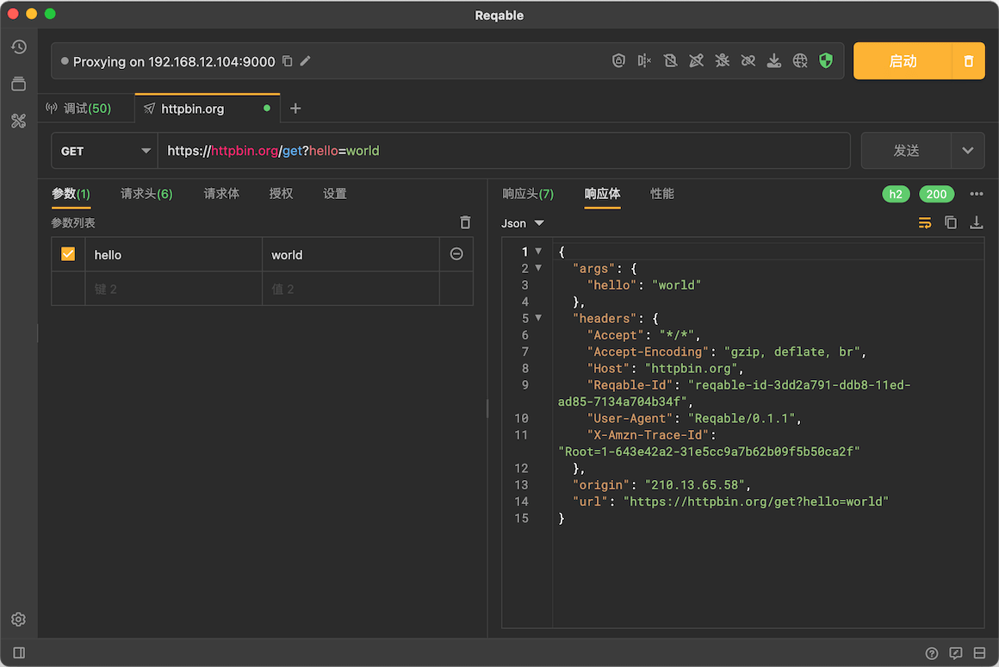

# 概览

Reqable是一款跨平台的专业HTTP开发和调试工具，在全平台支持HTTP1、HTTP2和HTTP3(QUIC)协议，简单易用、功能先进、性能高效，助力企业提升接口生产效率！本产品需要一定的网络基础知识，仅适合开发、测试、网络、安全、爬虫等工程专业人员使用，或者在专业人员的指导下使用。

:::warning 许可声明
Reqable是一款用于企业接口生产的网络基础设施工具，某些特性可以修改网络传输数据，其设计和目的均是用于接口生产过程中的开发、调试和测试，请勿用于非许可用途！更多信息，请参阅[使用条款](https://reqable.com/policy)。
:::

## 特性

Reqable提供了两大基本功能：**[抓包调试](#capture)**和**[接口测试](#rest)**，前者用于HTTP接口的调试，后者用于HTTP接口的开发，两者相辅相成。同时，Reqable还提供了一些常用的技术[辅助工具](#toolbox)，尽可能一站式完成接口生产相关工作。

#### 1. 抓包调试 {#capture}

通过Web中间人代理的方式对本机以及局域网设备进行HTTP流量分析和调试。

- [x] 支持HTTP/1.x, HTTP2协议版本，HTTP3(QUIC)暂不支持。
- [x] 支持HTTP/HTTPS/Socks4/Socks4a/Socks5代理方式。
- [x] 支持HTTPS，TLSv1.1、TLSv1.2和TLSv1.3加密协议。
- [x] 搜索和筛选：提供快捷筛选栏和多条件高级搜索。
- [x] 网关功能：对指定请求或响应进行屏蔽，挂起等操作。
- [x] 重写功能：预设规则对指定请求或响应进行重定向、替换或者修改。
- [x] 断点功能：对请求或响应进行实时断点操作，比如屏蔽，挂起或修改替换数据等。
- [x] 脚本功能：支持编写Python脚本处理实时请求或响应。
- [x] 镜像功能：对指定域名配置镜像映射。
- [x] 接口联动：支持从调试列表创建[接口](#rest)。
- [x] 更多：历史记录、重发，高亮、HAR导入导出等。

#### 2. 接口测试 {#rest}

类似Postman，可以编辑和发送HTTP请求，用来测试接口请求。

- [x] 多协议版本，支持HTTP/1.1, HTTP2和HTTP3(QUIC)。
- [x] 支持JSON/Text/Urlencode/Multiparts/Binary多数据类型。
- [x] 支持JSON/XML/图片/HEX/Multiparts等多种视图，数据浏览更方便。
- [x] URL语法高亮和多行显示，对超长的URL非常友好。
- [x] Header编辑具有自动提示功能，以及超赞的批量编辑。
- [x] Cookie管理，自动保存Cookie并在请求头中自动加入关联的Cookie。
- [x] cURL导入和导出，在同事之间快速分享REST请求。
- [x] 请求授权设置，支持API KEY、Basic Auth和Bearer Token。
- [x] Web代理设置，支持自定义代理配置，系统代理和调试代理。
- [x] 调试联动：[调试](#capture)的相关配置均可用做用于接口测试。
- [x] 更多：历史记录、集合等。

#### 3. 辅助工具 {#toolbox}

Reqable提供了一些常用的辅助工具。

- [x] Base64编解码。
- [x] URL编解码。
- [x] Md5计算。
- [x] 时间戳转换。
- [x] JSON/XML查看器。
- [x] 二维码生成。
- [ ] 正则表达式测试。
- [ ] 接口数据Diff。

## 历史

Reqable的前身是HttpCanary（一款Android平台应用程序），但是我们推翻了所有的技术栈，并用C++和Flutter重写，只保留了logo和主题色，所以两者并没有太多关联。当然，Reqable的使命之一，就是完全替代HttpCanary。
