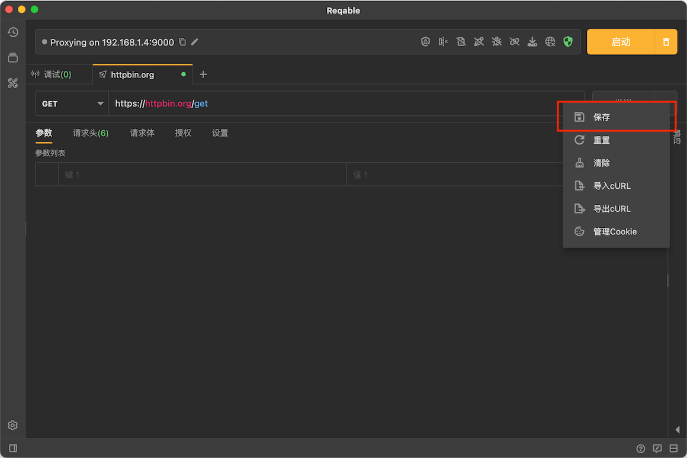
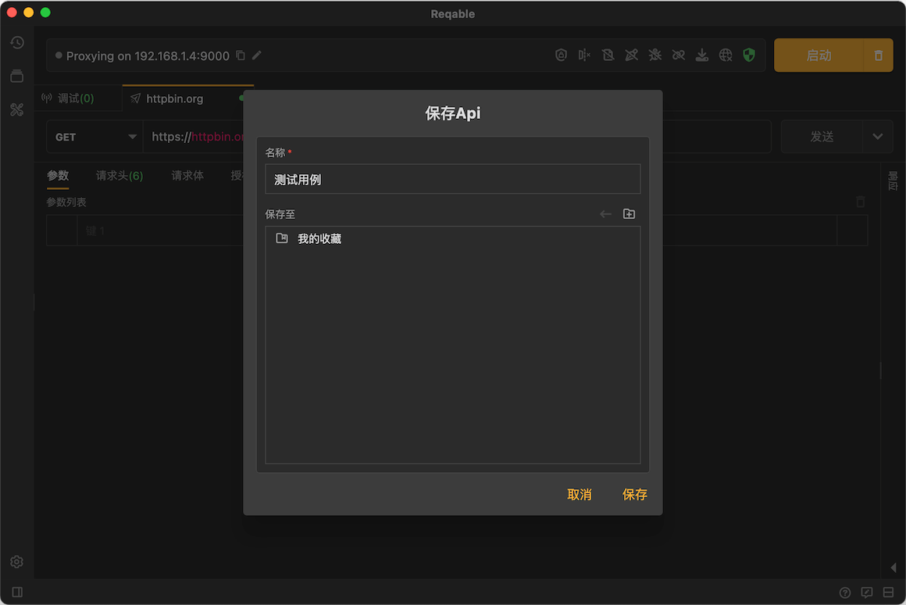
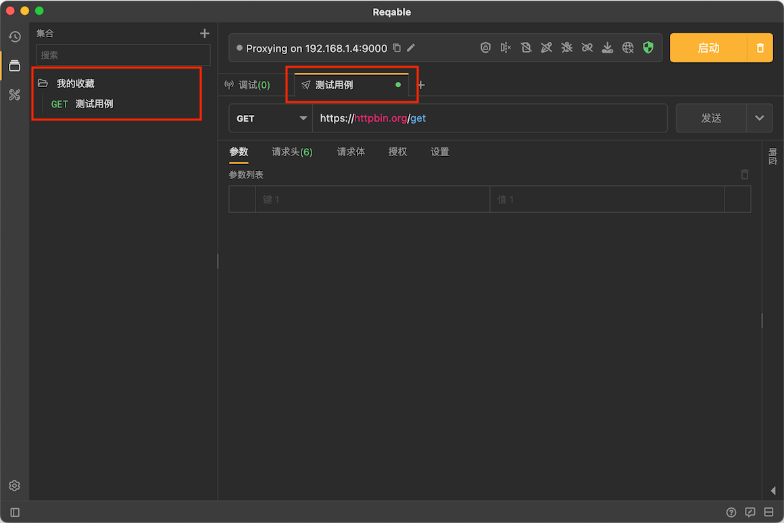
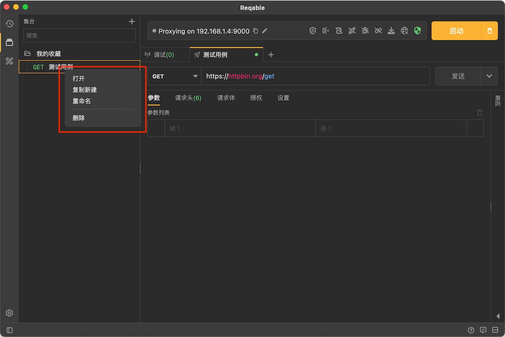
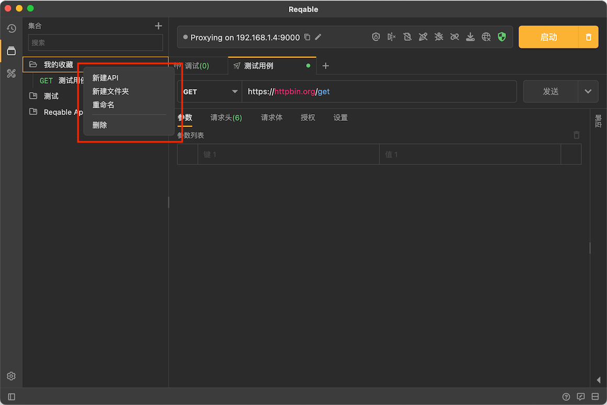

# 集合

import Shortcut from '@site/src/components/Shortcut';

Reqable支持将API请求收藏到集合中，并可以随时回顾或编辑。点击右上角打开更多操作菜单，选择保存（快捷键 <Shortcut>Control + S</Shortcut> ）：

在弹出的对话框中输入名称并选择存放的集合：

点击保存后，便可以在侧边栏的集合面板中看到保存的API了，同时还能看到选项卡的标题也变成了API的名称：

需要回溯的时候，在侧边栏集合中直接点击打开，或者右键选择打开、复制新建、重命名或者删除。

当然，集合中还可以创建子文件夹，或者对集合进行重命名，删除等操作：

:::caution 注意

为了更加直观地展示，Reqable限制集合中子文件夹的层级不超过4。

:::