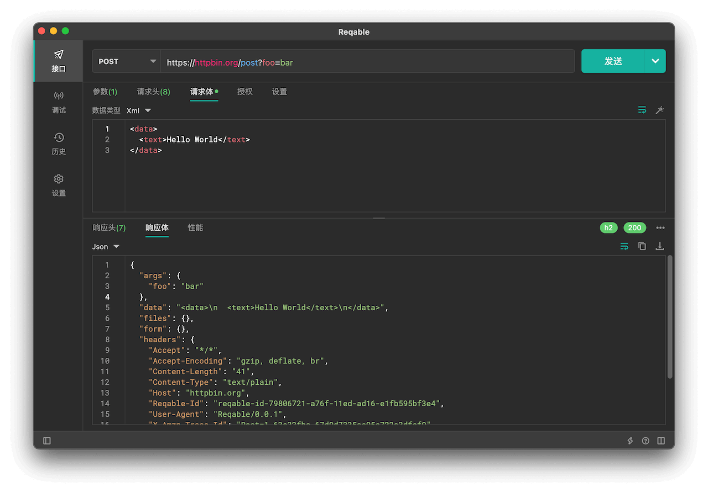

# 接口

RESTful接口测试是Reqable的两大基本功能之一，帮助开发者调试接口API。Reqable目前支持HTTP1.1、HTTP2和HTTP3（QUIC）协议，核心网络库采用的是[Cronet](https://chromium.googlesource.com/chromium/src/+/master/components/cronet/)，业内最前沿的HTTP网络请求框架。

Reqable提供了多样化的接口测试功能：
- [请求方法](method)
- [请求头部](header)
- [请求体](body)
- [协议版本](protocol)
- [请求ID](request_id)
- [Cookie](cookie)
- [授权](authorization)
- [代理](proxy)
- [重定向](redirect)
- [性能指标](metrics)
- [cURL支持](curl)